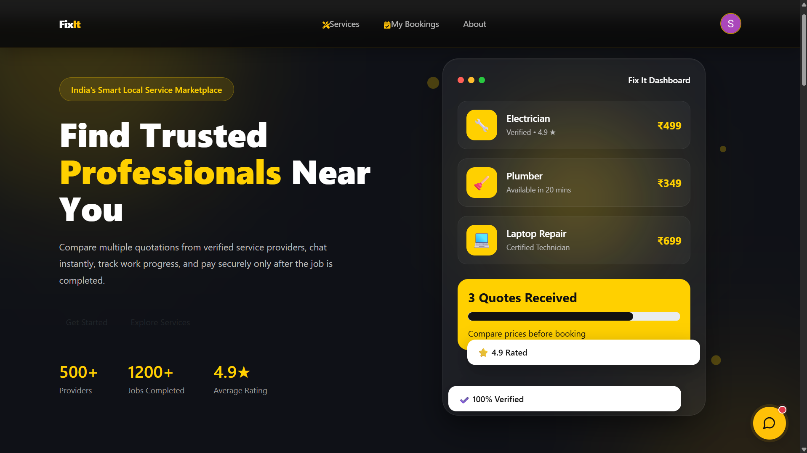
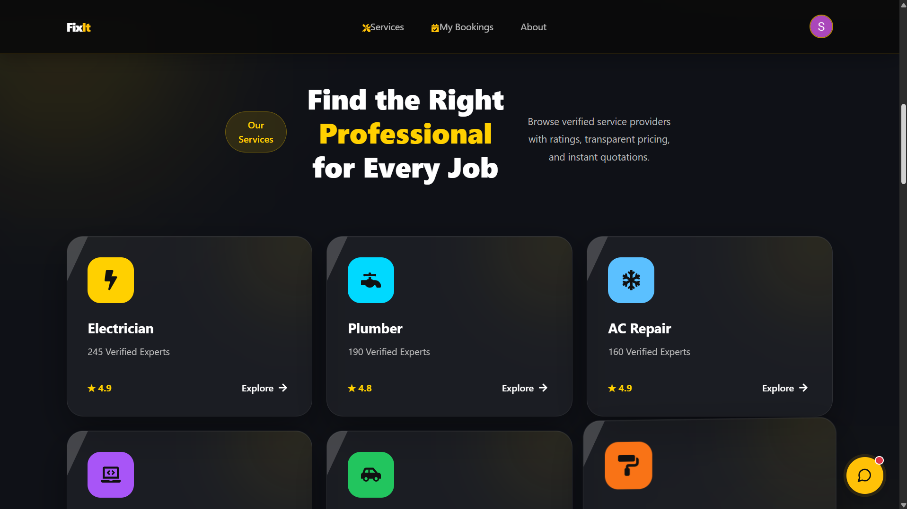
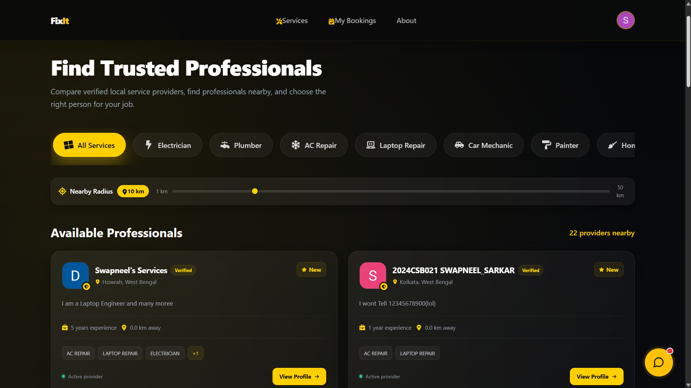
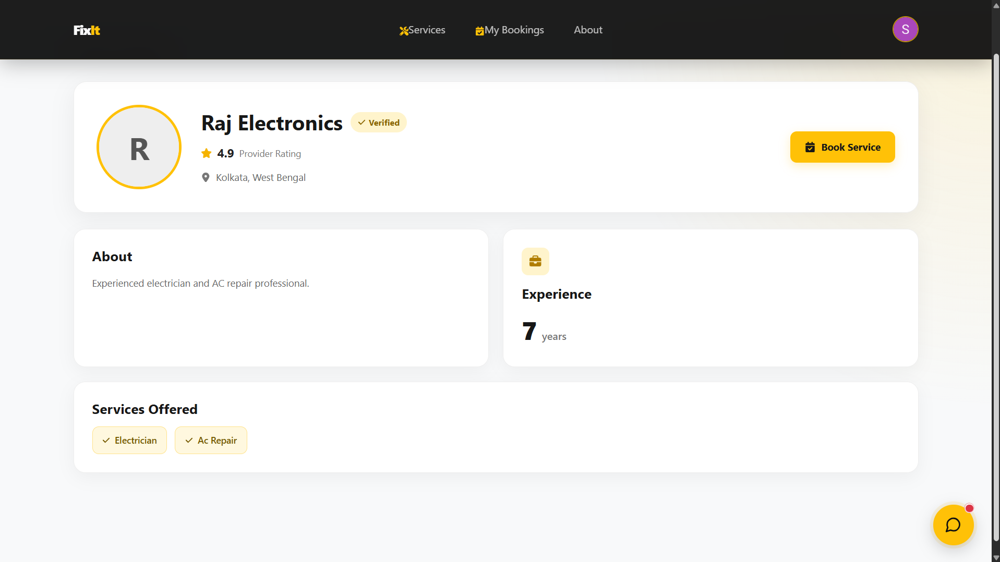
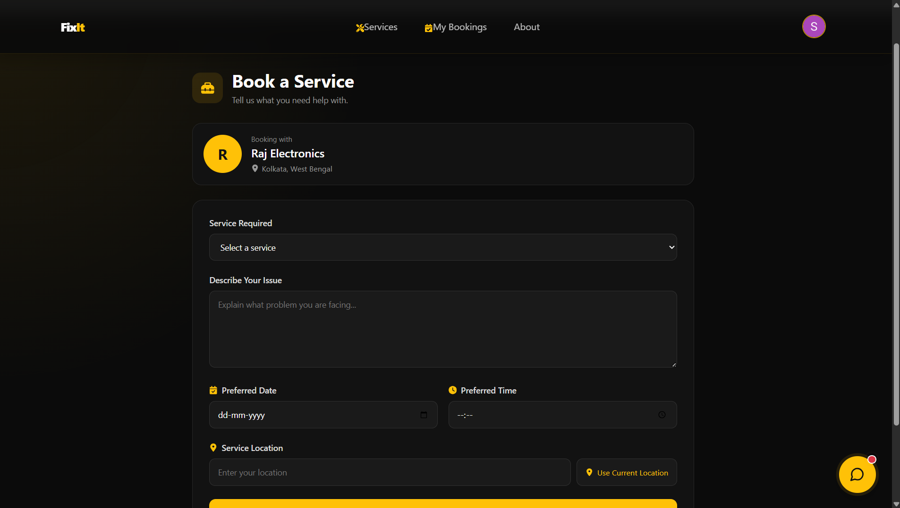
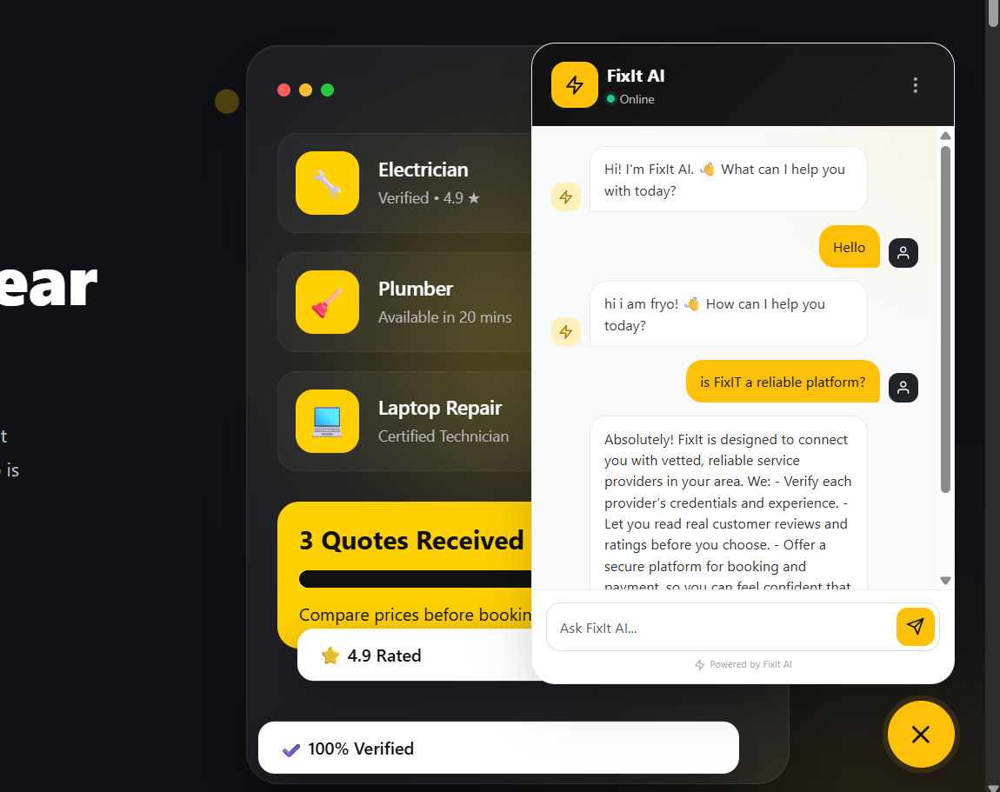
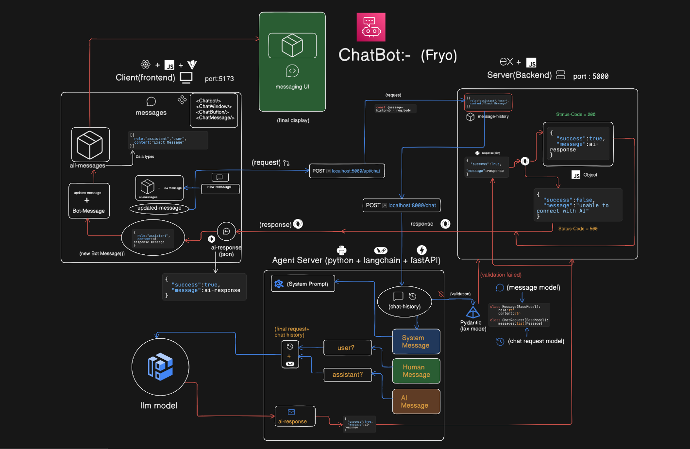
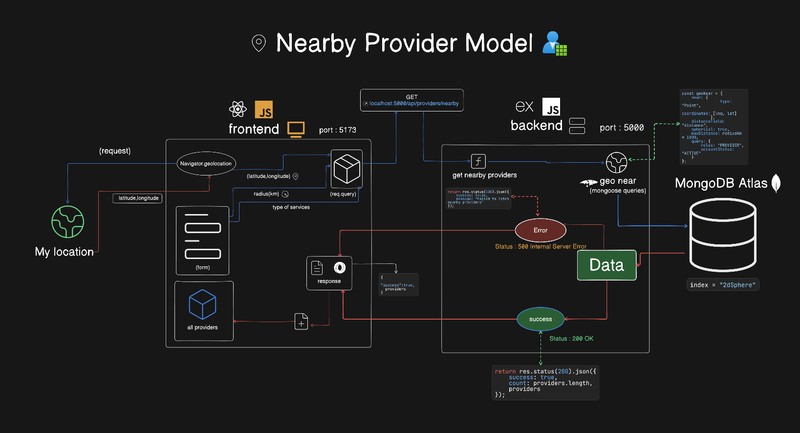
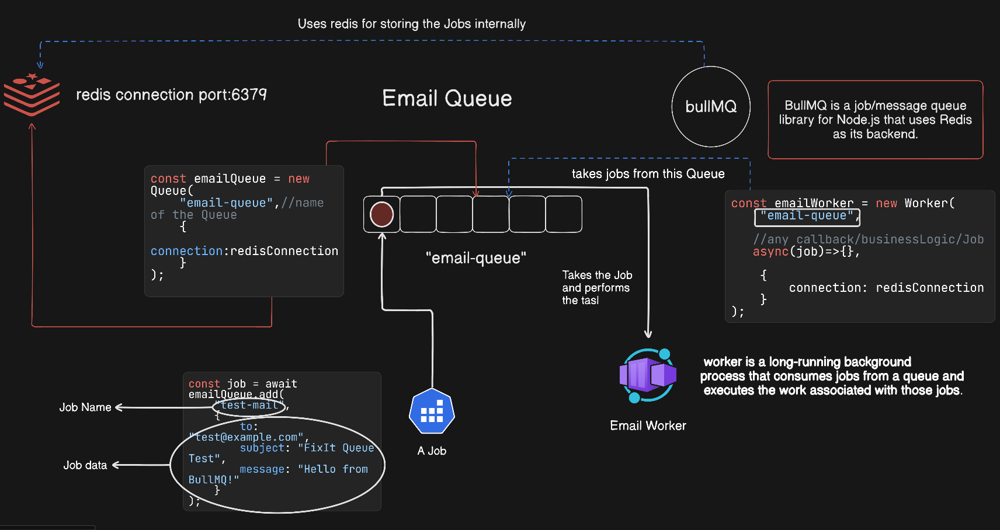

# 🔧 FixIt — Find Reliable Local Services

> **A full-stack local service marketplace connecting customers with reliable service providers.**

FixIt makes it easier for customers to discover nearby service professionals, request services, and manage bookings — while giving providers a platform to receive and manage service requests.

**Services include:** Electricians · Plumbers · AC Repair · Laptop Repair · Car Mechanics

---

## 🌐 Application Preview

### 🏠 Landing Page

| Landing Page View 1 | Landing Page View 2 |
| :--- | :--- |
|  |  |

---

### 🛠️ Services & Provider Discovery

| Services Page View 1 | Services Page View 2 |
| :--- | :--- |
|  |  |

---

### 📅 Service Booking

---

### 🤖 Chatbot Assistant

| Chatbot Interface (UI) | Chatbot Architecture (Eraser Design) |
| :--- | :--- |
|  |  |

---

## 🏗️ System Architecture

| Architecture Diagram 1 | Architecture Diagram 2 |
| :--- | :--- |
|  |  |

### Architecture Flow

                         ┌─────────────────┐
                         │   React / Vite  │
                         │    Frontend     │
                         └────────┬────────┘
                                  │
                                  ▼
                         ┌─────────────────┐
                         │ Node.js /       │
                         │ Express.js      │
                         └───────┬─────────┘
                                 │
                  ┌──────────────┼──────────────┐
                  │              │              │
                  ▼              ▼              ▼
             ┌─────────┐   ┌──────────┐   ┌──────────┐
             │ MongoDB │   │  Redis   │   │ FastAPI  │
             │         │   │          │   │ AI API   │
             └─────────┘   └────┬─────┘   └─────┬────┘
                                │               │
                                ▼               ▼
                           ┌─────────┐     ┌───────────┐
                           │ BullMQ  │     │ LangChain │
                           └────┬────┘     │   Agent   │
                                │          └─────┬─────┘
                                ▼                │
                         Email Worker            ▼
                                │              LLM
                                ▼                │
                             Resend              ▼
                                           Pydantic
                                                │
                                                ▼
                                          JSON Response

# 🧑‍💻 Complete Tech Stack

FixIt is built as a full-stack service marketplace with authentication, geospatial provider discovery, asynchronous background processing, transactional email, and an AI-powered service layer.

---

## 🎨 Frontend

| Technology / Tool | Purpose |
|---|---|
| **React.js** | Component-based frontend development |
| **Vite** | Development server and production build tooling |
| **JavaScript (ES6+)** | Application logic and client-side functionality |
| **HTML5** | Page structure and semantic markup |
| **CSS3** | Custom styling and responsive layouts |
| **Bootstrap** | Responsive UI components and layouts |
| **Framer Motion** | UI animations and page transitions |
| **AOS (Animate On Scroll)** | Scroll-based animations |
| **React Icons** | UI icons |
| **Clerk React** | Frontend authentication |
| **Fetch API** | Backend API communication |
| **Browser Geolocation API** | Obtaining user's current location |

---

## ⚙️ Backend

| Technology / Tool | Purpose |
|---|---|
| **Node.js** | Backend JavaScript runtime |
| **Express.js** | REST API and server framework |
| **Mongoose** | MongoDB ODM and schema management |
| **JavaScript / ES Modules** | Backend application development |
| **dotenv** | Environment variable management |
| **Clerk Express** | Backend authentication and user verification |
| **Express Router** | Modular API route management |
| **Middleware** | Authentication and request processing |
| **REST APIs** | Frontend-backend communication |
| **Nodemon** | Automatic backend restart during development |

---

## 🤖 AI / LLM

| Technology / Tool | Purpose |
|---|---|
| **Python** | AI service development |
| **LangChain** | LLM application orchestration |
| **LangChain Agents** | Building tool-using AI agents |
| **LLMs** | Natural language understanding and generation |
| **Prompt Templates** | Structured prompt construction |
| **Tool Calling** | Connecting AI agents with application functionality |
| **Structured Output** | Generating predictable AI responses |
| **Pydantic** | Schema validation and structured data models |
| **FastAPI** | Serving the AI service through REST APIs |
| **Python Type Hints** | Type-safe AI service development |
| **JSON** | Structured communication between services |

# 🔮 Future Enhancements

FixIt is actively evolving, with several planned improvements aimed at making the platform more intelligent, scalable, and production-ready.

---

## 🤖 AI-Powered Improvements

- **AI Service Recommendation**  
  Recommend the most suitable service or provider based on the user's issue description, location, budget, and previous requests.

- **AI-Powered Issue Diagnosis**  
  Allow users to describe their problem in natural language and let the AI identify the likely issue and required service.

- **AI Provider Matching**  
  Build an intelligent matching system that ranks providers based on distance, ratings, expertise, availability, and user requirements.

- **AI Chat Assistant**  
  Add a conversational assistant that can help users discover services, understand pricing, and track their service requests.

- **Multimodal AI Support**  
  Allow users to upload images of damaged appliances, devices, or other issues for AI-assisted diagnosis.

---

## 📍 Advanced Location Features

- **Interactive Maps**
- **Real-Time Provider Location Tracking**
- **Route & Distance Estimation**
- **Dynamic Service Radius**
- **Location-Based Provider Ranking**
- **Real-Time Provider Availability**

---

## 💬 Communication

- **Real-Time Customer–Provider Chat**
- **Socket.io-Based Messaging**
- **Typing Indicators**
- **Message Read Receipts**
- **In-App Notifications**
- **Email & Notification Preferences**

---

## 💳 Payments

- **Online Payment Integration**
- **Secure Payment Processing**
- **Payment After Service Completion**
- **Digital Invoices**
- **Transaction History**
- **Refund Management**

---

## ⭐ Reviews & Reputation

- **Customer Reviews**
- **Provider Ratings**
- **Verified Reviews**
- **Provider Reputation Score**
- **Review-Based Provider Ranking**

---

## ⚡ Scalability & Performance

- **Redis Caching**
- **Advanced BullMQ Job Processing**
- **Automatic Job Retries**
- **Scheduled Background Jobs**
- **Rate Limiting**
- **API Caching**
- **Database Query Optimization**
- **MongoDB Index Optimization**
- **Horizontal Scaling of API Servers**
- **Independent Worker Scaling**

---

## 🔐 Security Enhancements

- **Advanced Role-Based Access Control**
- **API Rate Limiting**
- **Request Validation**
- **Security Headers**
- **CSRF Protection**
- **Input Sanitization**
- **Audit Logs**
- **Improved Secret Management**

---

## 🐳 DevOps & Deployment

- **Dockerize Frontend, Backend, AI Service, and Workers**
- **Production Docker Compose Configuration**
- **CI/CD Pipeline**
- **Automated Testing**
- **Automated Deployment**
- **Environment-Specific Configurations**
- **Application Monitoring**
- **Centralized Logging**
- **Health Check Endpoints**

---

## 🧪 Testing

- **Unit Testing**
- **Integration Testing**
- **API Testing**
- **End-to-End Testing**
- **AI Agent Evaluation**
- **Queue & Worker Testing**
- **Automated Test Pipeline**

---

## 📊 Analytics & Admin Dashboard

- **Admin Dashboard**
- **Provider Management**
- **Customer Management**
- **Booking Analytics**
- **Revenue Analytics**
- **Service Demand Analytics**
- **Provider Performance Metrics**
- **Platform Activity Monitoring**

---

## 🌍 Platform Expansion

- **Multiple Cities & Regions**
- **Multi-Language Support**
- **Multi-Currency Support**
- **Mobile Application**
- **Provider Mobile Dashboard**
- **Customer Mobile Application**

---

## 🚀 Long-Term Vision

The long-term goal is to evolve FixIt from a local service marketplace into an **AI-powered service discovery and management platform** where users can describe a problem in natural language, receive intelligent recommendations, find trusted nearby professionals, communicate with them, and manage the entire service lifecycle from a single platform.